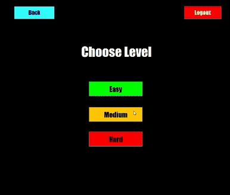

# Breakout

## Project Description

This project is developed as a part of the Semester 6 - Object-Oriented Analysis and Design with Java (OOADJ) course at PES University.

Breakout is a Java-based object-oriented analysis project that implements a classic arcade game. In this game, players control a paddle at the bottom of the screen to bounce a ball towards a wall of bricks at the top. The objective is to break all the bricks by hitting them with the ball while ensuring that the ball doesn't fall off the bottom of the screen.

## Features

* **Smooth Controls:** Enjoy responsive controls allowing precise movement of the paddle to direct the ball's trajectory.
* **Realistic Physics:** Experience realistic ball movement with accurate bouncing off walls and bricks at different angles.
* **Level Selection:** Players can choose their preferred level before starting the game, each offering unique challenges and difficulties.
* **Login and Signup Functionality:** Users can create an account, log in, and save their game progress.
* **Leaderboard:** Compete with other players and view high scores on the leaderboard.
* **Game History:** Track past game performances and review game statistics.

## Gameplay

Players control the paddle using arrow keys, directing the ball towards the bricks to break them. The ball rebounds off the paddle and walls, aiming to destroy all bricks while preventing the ball from falling off the bottom of the screen. Points are earned for each brick destroyed, and players progress through levels with increasing complexity.

Project Structure

* **src/:** Contains the Java source code for the game.
* **README.md:** Provides project overview, instructions, and gameplay demo.

## Demo

## Class Diagram

## Use of Design Principles and Design Patterns

Various design patterns have been integrated into our implementation to make the design more robust. The Factory Pattern centralizes Game creation logic, adhering to the Open/Closed Principle for easy extension via new Game types. State Pattern in GamePanel promotes Dependency Inversion by decoupling state transitions from specific key inputs. Additionally, we've applied GRASP concepts such as Creator and Controller patterns to delegate responsibilities effectively, ensuring clear and intuitive class designs.

### Creational Patterns

* **Factory Pattern** : Used for the creation of a Game object, given level as input. BreakoutGameFactory class implements the GameFactory interface which defines a method ‘getGameInstance()’ that returns an object of Game class.
* **Singleton Pattern** : Ensures that the Game has only one instance of Paddle.

### Structural Patterns

* **Facade Pattern** : Abstracts and simplifies the interaction between the Ball, Brick, and Paddle.
* **Flyweight Pattern** : Stores common brick properties in flyweight object, minimizing memory usage.

### Behavioural Pattern

* **State Pattern** : Utilized in GamePanel class for managing game states (playing, paused, and quit) based on user input. It toggles between playing and paused states with Enter or P key presses, while pressing Q returns to the menu page.

## Contributors

- Gayathri Manoj ([@GayathriManoj2003](https://github.com/GayathriManoj2003))
- R.S. Moumitha ([@Moumitha120104](https://github.com/Moumitha120104))
- Sai Manasa Nadimpalli ([@Mana120](https://github.com/Mana120))
- Shreya Kashyap ([@Shreya241103](https://github.com/shreya241103))
